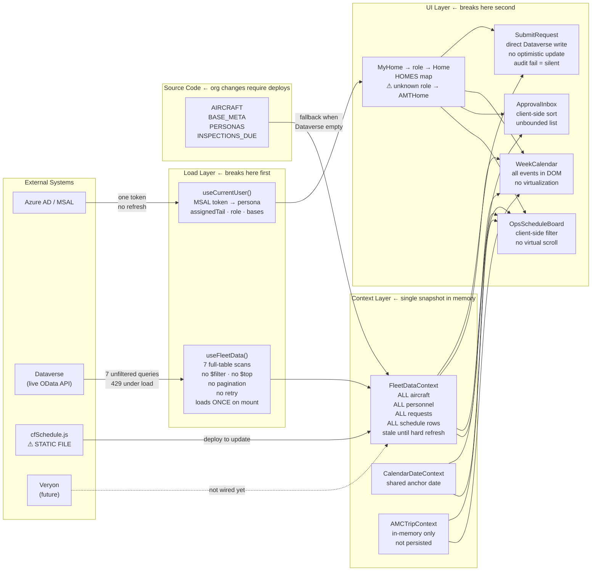

# OpsConnect — Enterprise Architecture: Data Flow & Failure Analysis

Built as a demo, designed to grow into a live scheduling system for 1,000+
employees across 40+ bases. This document maps where the architecture
holds and where it breaks under real load.

---

## Data Flow Diagram

Every piece of data in the app passes through one of four paths.
The red labels are where each path can fail at enterprise scale.

---

## Where It Breaks, Ranked by Impact

### CRITICAL — Will fail under load

**1. Full-table scans on every app open**
`useFleetData` fires 7 parallel Dataverse queries with zero OData parameters.
No `$filter`, no `$top`, no `$select`. Every employee opening the app at
6:00am shift change downloads the entire personnel table, entire aircraft
table, and every schedule entry ever written.

Dataverse default page size is 5,000 rows. Once any table exceeds 5,000 rows
the app silently receives a truncated dataset. The user sees incomplete data
with no indication anything is wrong.

Fix direction: server-side filtering with `$filter=cr463_region eq 'WY/MT'`
scoped to the user's region on load. Fleet-wide views (Director) paginate.

---

**2. No refresh. Data is stale from the moment it loads.**
`useFleetData` runs `useEffect(() => { load() }, [])` — the empty dependency
array means it runs exactly once at mount. An AOG posted at 3am is invisible
to every user who opened the app before then. A scheduler who publishes a new
shift won't see it on another user's screen without a hard refresh.

For an aviation company where an AOG event is an operational emergency, stale
aircraft status is not a UX annoyance — it's a safety coordination risk.

Fix direction: poll every 60s for critical tables (aircraft status, conflicts).
WebSocket or Dataverse change notifications for AOG/emergency bulletins.

---

**3. `cfSchedule.js` is a 132KB static file that requires a code deploy to update**
The on-call rotation for 40+ bases is a JavaScript array in source code.
When a mechanic swaps shifts, takes PTO, or a new base comes online, someone
must export from CompleteFlight, replace the file, and ship a deployment.
That is a multi-hour cycle for a change that should take seconds.

This is the single most important thing to move to Dataverse before go-live.

Fix direction: a `cr463_oncallschedule` Dataverse entity populated by a
Power Automate flow from the CompleteFlight API, queried like everything else.

---

**4. No rate-limit handling — 429s at peak time**
`useDataverse.query()` is a bare `fetch` with no retry, no exponential backoff,
no circuit breaker. If 200 people open the app at 07:00 shift start and each
triggers 7 queries, Dataverse returns 429 throttle responses. The app receives
empty arrays, shows demo data, and the user doesn't know.

Fix direction: exponential backoff with jitter in `useDataverse.js`. Surface
a "connection degraded" banner when queries fail rather than silent fallback.

---

### SERIOUS — Will degrade silently

**5. Unknown Dataverse roles silently become AMT**
`mapRole()` in `useCurrentUser.js` has 7 hardcoded string branches. Anything
that doesn't match falls through to `return 'AMT'`. A Director of Clinical
Operations, a Lead Pilot, or a new role added in Workday/Dataverse will open
the app as an aircraft mechanic with no error, no warning.

At 1,000 employees with evolving org structure, role drift in the source code
vs. Dataverse is guaranteed.

Fix direction: remove the fallback `return 'AMT'`. Return `null`, render an
"unrecognized role" screen, and log it. Roles should be additive in Dataverse,
not coded into the app.

---

**6. `AIRCRAFT`, `BASE_META`, and `PERSONAS` are in source code**
Adding a new base, retiring an aircraft, or restructuring a region requires a
code change and deployment. These are operational facts that change monthly.
An ops manager should be able to add a base in Dataverse and have it appear
in every view immediately.

Fix direction: `AIRCRAFT` and `BASE_META` become Dataverse entities. The static
arrays become the demo fallback only, same pattern already used for personnel.

---

**7. No optimistic updates — every form action blocks on two round trips**
`SubmitRequest` calls `create(TABLES.mxRequest)` then `create(TABLES.audit)`
sequentially. The user stares at a spinner until both complete. If the audit
write fails (permissions, schema mismatch), it silently swallows the error —
the form shows success but compliance logging has a gap.

At 1,000 employees submitting shift swaps, time-off requests, and MX
schedules, a flaky audit table creates invisible compliance holes.

Fix direction: optimistic update on submit. Write audit in the background.
Surface audit failures to the submitter explicitly.

---

**8. `ApprovalInbox` and `WeekCalendar` render unbounded lists**
Both components dump all records into the DOM with no virtualization. A
regional manager with 200 pending requests and a scheduler viewing 500 weekly
events will trigger browser memory pressure and layout thrashing.

Fix direction: `react-window` or `react-virtual` for the inbox list. The
calendar already caps month view at 3 per day — week view needs the same cap
with a "+N more" overflow rather than rendering all 500 event nodes.

---

### STRUCTURAL — Will limit growth

**9. `AMCTripContext` lives only in memory — not persisted**
Allocated AMC trips vanish on page refresh. Two schedulers working
simultaneously can allocate the same aircraft to different trips with no
conflict detection. There is no write-back to Dataverse when a trip is
allocated, so the trips exist only in one browser session.

Fix direction: `addTrip()` should write to a `cr463_amctrip` Dataverse entity.
The context becomes a read-through cache, not the source of truth.

---

**10. `PREFIX = 'cr463_'` is a single point of deployment failure**
One line in `schema.js` controls every Dataverse field name across every
hook and mapper. Wrong prefix → every field is `undefined` → silent fallback
to demo data across the entire app. Changing tenants (IHC division expansion)
requires careful coordination of this one constant.

This is appropriate architecture for now, but must be documented prominently
and tested with an integration smoke test on every deployment.

---

## Summary Table

| # | What | Failure mode | Priority |
|---|---|---|---|
| 1 | Full-table scans | Truncated data past 5,000 rows, silent | Ship blocker |
| 2 | No data refresh | Stale AOG/schedule during operations | Ship blocker |
| 3 | cfSchedule.js static | Deploy required for every shift change | Ship blocker |
| 4 | No 429 handling | Silent data loss at shift-change peak | Ship blocker |
| 5 | Hardcoded roles | New roles render as AMT, no warning | Pre-scale |
| 6 | Org data in source | Base/aircraft changes need code deploys | Pre-scale |
| 7 | Silent audit failure | Compliance gaps, no user notice | Pre-scale |
| 8 | Unbounded list render | Browser crash on large inbox/calendar | Pre-scale |
| 9 | AMC trips in memory | Lost on refresh, no conflict detection | Post-scale |
| 10 | Single PREFIX constant | Silent total failure on wrong tenant | Document now |

**Items 1–4 must be resolved before this app handles live operational data.**
Items 5–8 must be resolved before organization-wide rollout.
Items 9–10 are acceptable technical debt with clear migration paths.
