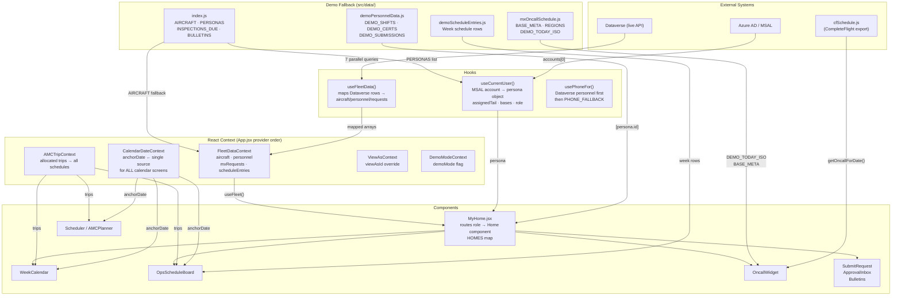

# OpsConnect — Data Flow & Troubleshooting Guide

This document is for contributors. It answers the two questions that come up most:
**"Why isn't my data showing?"** and **"Where do I add X?"**

---

## Data Flow Diagram



---

## Where Each Piece of Data Lives

| What you see in the UI | Source (live) | Source (demo fallback) | Key file |
|---|---|---|---|
| Aircraft list & status | `FleetDataContext.aircraft` | `AIRCRAFT` in index.js | `useFleetData.js` |
| Personnel / "View as" list | `FleetDataContext.personnel` | `PERSONAS` in index.js | `useFleetData.js` |
| MX Requests / approvals | `FleetDataContext.mxRequests` | `PENDING_REQUESTS` in index.js | `useFleetData.js` |
| Week schedule rows | `FleetDataContext.scheduleEntries` | `demoScheduleEntries.js` | `OpsScheduleBoard.jsx` |
| On-call rotation | `CF_SCHEDULE` (static) | same — always static | `cfSchedule.js` |
| Nurse shifts | Dataverse (future) | `DEMO_SHIFTS[persona.id]` | `demoPersonnelData.js` |
| Nurse / AMT certs | Dataverse (future) | `DEMO_CERTS[persona.id]` | `demoPersonnelData.js` |
| AMT submissions | `mxRequests` filtered by name | `DEMO_SUBMISSIONS[persona.id]` | `demoPersonnelData.js` |
| Bulletins banner | `BULLETINS` in index.js | same — static | `index.js` → `BulletinBanner` |
| Calendar anchor date | `CalendarDateContext` | `DEMO_TODAY_ISO` | `CalendarDateContext.jsx` |
| Assigned aircraft (AMT) | `persona.assignedTail` from Dataverse | `assignedTail` in PERSONAS | `useCurrentUser.js` |

---

## Failure Modes & How to Diagnose

### 1. "Live data isn't showing — I see demo data"
`useFleetData` uses `Promise.allSettled`, so a failed Dataverse query silently
returns `[]`. Components then fall back to static files with no error shown.

**Diagnose:** Open DevTools → Network. Look for requests to
`*.api.crm.dynamics.com`. A 401 means the MSAL token expired or the user
doesn't have Dataverse access. A 404/403 means the table or PREFIX is wrong.

**The one line that controls all Dataverse field names:**
```js
// src/auth/schema.js
export const PREFIX = 'cr463_';   // ← change this for a new tenant
```
If this is wrong, every Dataverse field returns `undefined` and the app falls
back to demo data with no error.

### 2. "Calendar shows the wrong week"
All calendar screens share `CalendarDateContext`. Any component calling
`setAnchorDate()` moves all calendars. If a new component manages its own local
date state instead of using the context, it will appear desynced.

**Diagnose:** Check that the component imports `useCalendarDate` and does
**not** have a local `useState` for its anchor date.

### 3. "New persona's home screen shows the wrong content"
Two places must agree: `PERSONAS` in `index.js` (adds the persona to the
"View as" picker) and `HOMES` in `MyHome.jsx` (routes their role to a home
component). If one is missing, the persona either doesn't appear in the picker
or silently renders `AMTHome`.

```js
// MyHome.jsx — must have an entry for every role string
const HOMES = {
  DIRECTOR: DirectorHome,
  RMM:      RMMHome,
  AMT:      AMTHome,
  // ← missing role lands here silently ↓
};
const Home = HOMES[persona?.role] ?? AMTHome;
```

### 4. "Demo data shows past dates"
`DEMO_TODAY_ISO = '2026-05-18'` in `mxOncallSchedule.js` is the anchor for
all relative dates (`dISO(n)`, `dMDY(n)`, inspection due dates, open shifts).
This must be bumped manually when re-running the demo on a later date.

**Every** relative date in the demo traces back to this one constant. Update
it and all dates cascade automatically.

### 5. "New nurse/AMT shows empty shifts or certs in demo mode"
`demoPersonnelData.js` is keyed by `persona.id`. If you add a new persona to
`PERSONAS` but don't add a matching entry to `DEMO_SHIFTS`/`DEMO_CERTS`/
`DEMO_SUBMISSIONS`, the component renders `[]` with no error. This is correct
for live Dataverse users (they have no demo data), but wrong for new demo personas.

**Pattern to follow:** Every new `PERSONAS` entry with role `AMT` or
`FLIGHT_NURSE` should have a matching key in `demoPersonnelData.js`.

### 6. "Audit submission succeeds but audit trail is empty"
`ApprovalInbox.jsx` and `SubmitRequest.jsx` both catch audit-write errors and
call `console.warn` — no UI feedback. A Dataverse permission issue on the audit
table will silently pass without the user knowing compliance logging failed.

---

## Rules for New Contributors

### Adding a new request type to SubmitRequest
1. Add it to `TYPE_CONFIG` in `SubmitRequest.jsx` — this controls form fields,
   routing, and the submit button label.
2. Add the matching string to `PENDING_REQUESTS` demo rows in `index.js` if you
   want it to appear in the Approval Inbox demo.
3. Do **not** hardcode the type string anywhere else — filter by the
   `TYPE_CONFIG` key.

### Adding a bulletin
Update `BULLETINS` in `src/data/index.js`. `BulletinBanner` reads directly from
this array. In production this will come from Dataverse; for now it's the only
place to edit.

### Adding a new base or region
1. Add to `BASE_META` in `mxOncallSchedule.js` (region + display label).
2. Add to `AIRCRAFT` in `index.js` (tail, type, base, region, status).
3. Add to `BASE_LOOKUP` in `baseMatch.js` if the Dataverse base name spelling
   differs from the AIRCRAFT.base string.
4. The CF on-call schedule (`cfSchedule.js`) is a raw export — do not edit
   manually; re-export from CompleteFlight and replace the file.

### Colors and design tokens
There is no single token file. Color definitions exist in at least four places:
`Dashboard.jsx` (`STATUS_COLORS`), `Bulletins.jsx` (`LEVEL_CFG`),
`OpsScheduleBoard.jsx` (PT config), and `WeekCalendar.jsx` (`EVENT_TYPES`).
When adding a new status badge, copy the pattern from the nearest existing one
in the same file. A future token consolidation into `src/ui.jsx` would help.

---

## Known Gaps (not bugs, but watch for them)

| Gap | Impact | Fix when needed |
|---|---|---|
| No React ErrorBoundary | One tab crash takes down the whole app | Wrap each tab in `<ErrorBoundary>` |
| `MXScheduler` timeline hardcoded | Shows "Fri 4/25" labels not tied to CalendarDateContext | Wire to `useCalendarDate()` |
| `BulletinBanner` can't show live bulletins | Requires code change to add a bulletin | Add `mxRequests` type filter or Dataverse bulletins table |
| Audit write failures are silent | Compliance log may be incomplete with no user notice | Surface audit errors in submit confirmation |
| No TypeScript | Wrong prop shapes fail at runtime, not build time | Gradual adoption with JSDoc types is low-cost first step |
| `demoScheduleEntries.js` week is fixed at `DEMO_TODAY_ISO` | Schedule board always shows same week in demo | Already correct — just update `DEMO_TODAY_ISO` |
