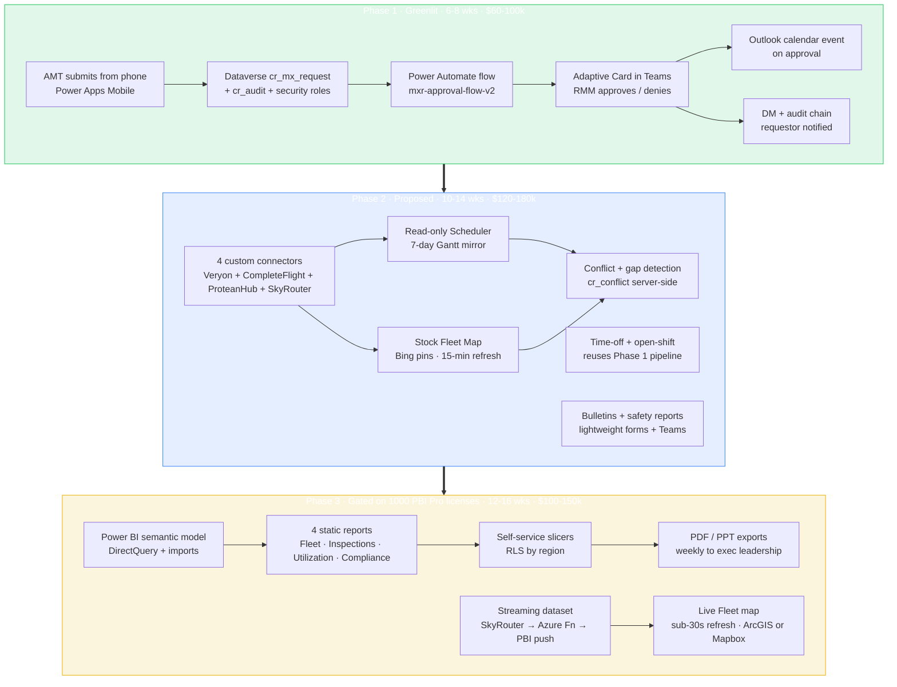

# Phase Flow Diagram — Mermaid Source

Three-phase rollout for IHC's M365 / Teams MX Connect deployment. The
Mermaid source below renders in GitHub, VS Code, and most markdown
viewers. Edit, paste into a Mermaid editor, or import into Lucidchart
via the companion CSV (`PhaseFlow.lucidchart.csv`).

## Phase flow

## Timeline

```mermaid
gantt
    title MX Connect · M365 Rollout Timeline
    dateFormat  X
    axisFormat  Wk %s
    section Phase 1 · Request → Approval
    Greenlit              :done,    p1,  0, 8
    section Phase 2 · Operations Layer
    Custom connectors     :active,  p2a, 8,  10
    Tables + flows        :         p2b, 10, 12
    Canvas screens        :         p2c, 14, 16
    Time-off + bulletins  :         p2d, 18, 20
    UAT + Prod            :         p2e, 20, 22
    section Phase 3 · Analytics + Live Tracking
    Semantic model        :crit,    p3a, 22, 24
    Static reports        :         p3b, 24, 28
    Streaming + map       :         p3c, 28, 31
    Embed + drill-through :         p3d, 31, 34
    UAT + adoption        :         p3e, 34, 38
```

## How to use

- **GitHub / VS Code:** Mermaid renders inline; just open this file.
- **Lucidchart:** Use the companion `PhaseFlow.lucidchart.csv` instead. 
  Lucidchart's CSV import doesn't accept Mermaid directly.
- **Standalone:** Copy the Mermaid source into
  https://mermaid.live for an interactive editor.
- **In the demo:** This same diagram is rendered as a React component on
  the **Phase Flow** tab of the deployed pitch demo (`src/tabs/PhaseFlow.jsx`).
